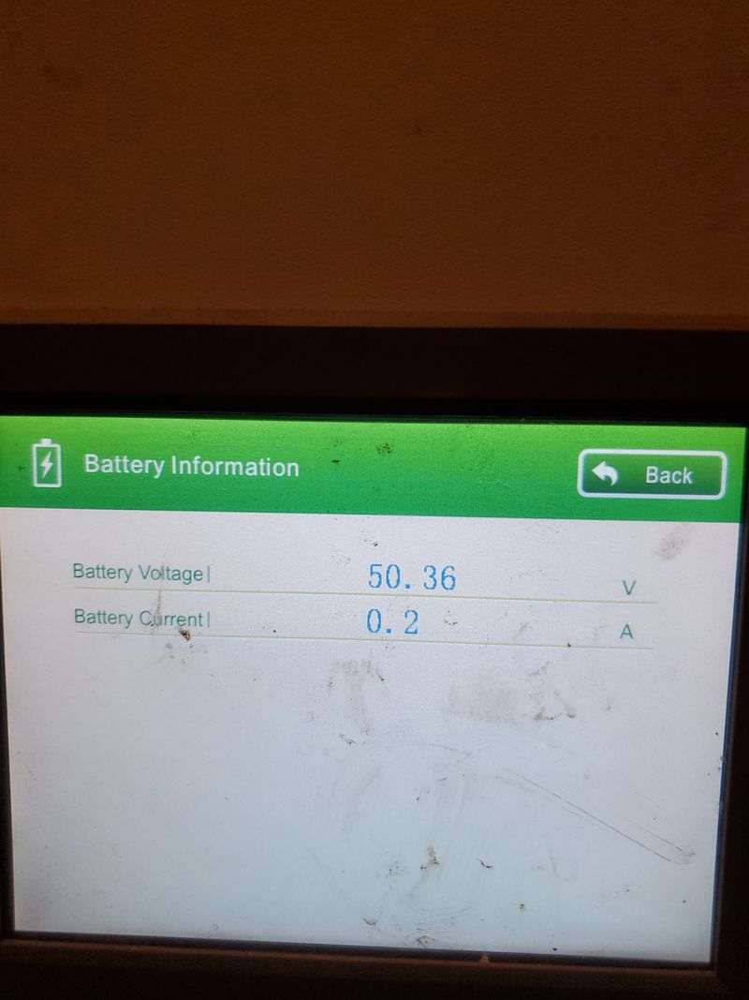
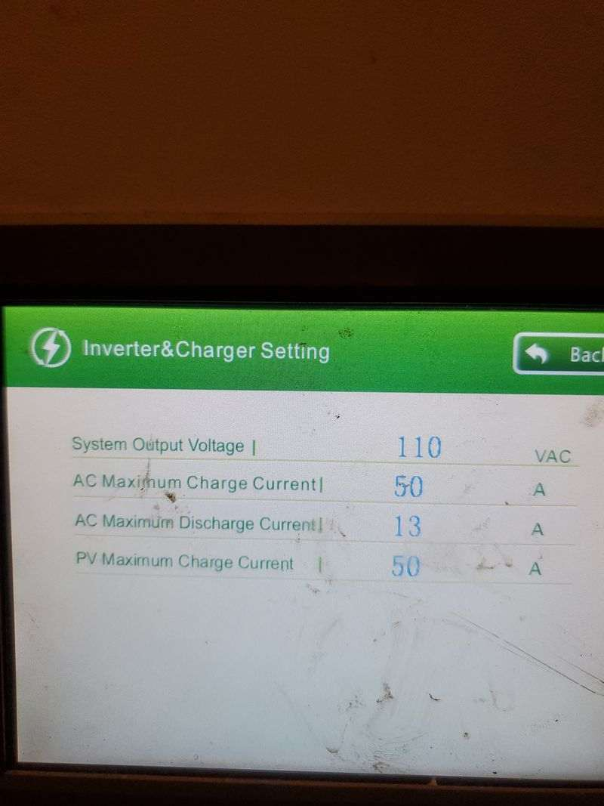
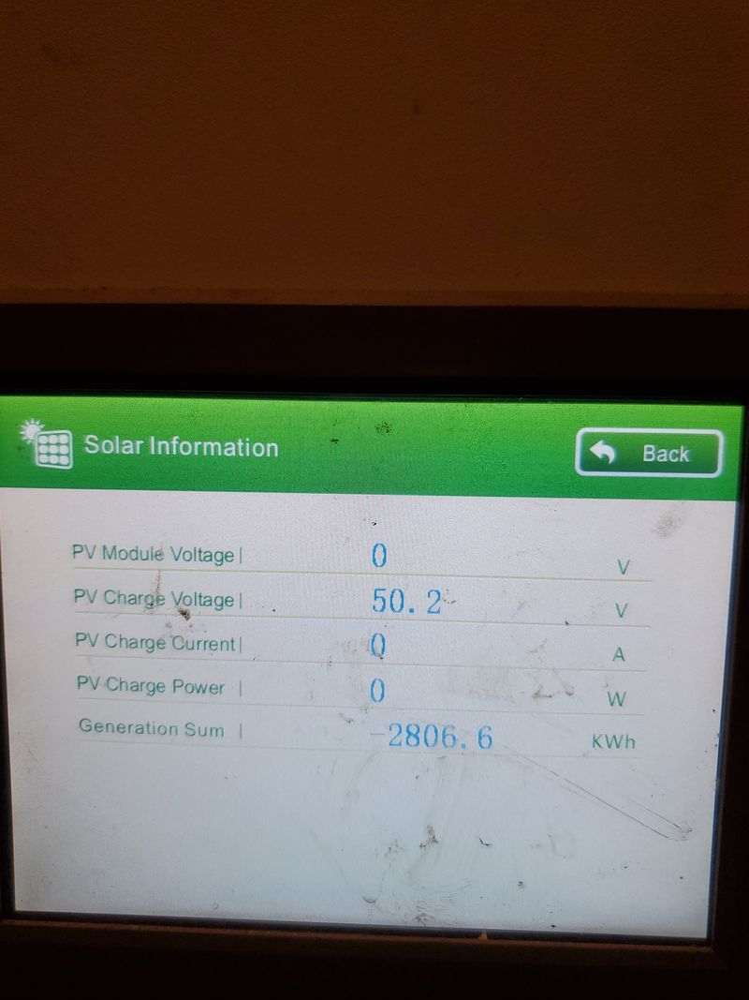

# Inverter Failure

In January 2023, a little under 3 year since being installed, when turning the unit on after storms had passed, the inverter failed. There was a series of loud pops, followed by a faint smell of burning plastic. 

After checking all wiring and restarting the unit, "Inverter Output Failure" is now shown on the system info page, and there is no output on Load1 or Load2.

Humless tech support offered no help. Says unit is not serviceable, and they cannot order a replacement inverter. 

Since I cannot afford another unit, and the batteries / charge controller are working fine, I am attemping to replace the failed component with a 3rd party inverter. 

## System info from Display

## Overview of the PS8050 AC and PS603B Boards

I think one or both of these are the inverter. I have not yet metered them to check for output...

## Internal Components

