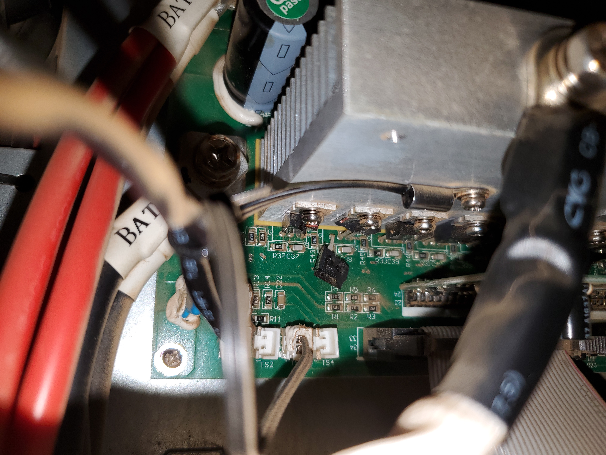
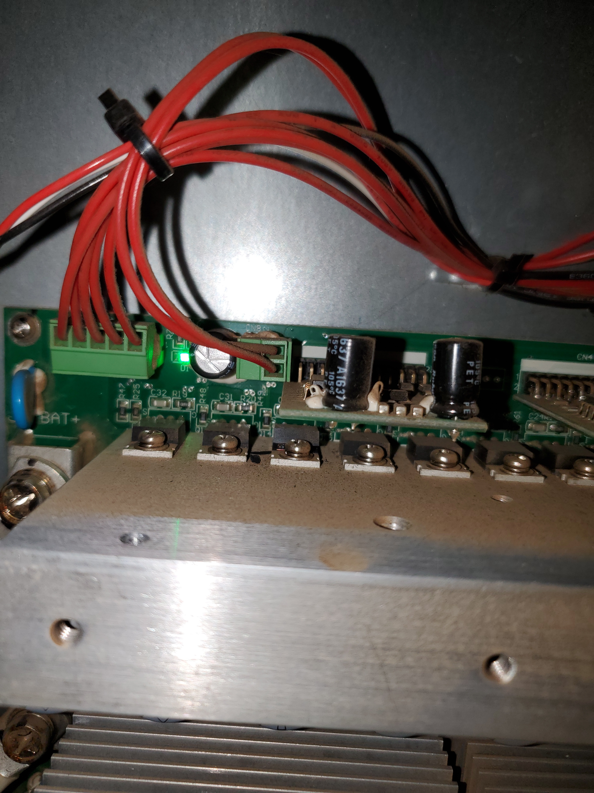

# PS6030B_INVPOWER board

3 of the board connections between the capacitors have broken off/popped. 

This coincides w/ the 3 rapid "pop" sounds heard when the unit was turned on.

This is on the back of the unit. 

Board is stamped "PS6030B INVPOWER"

The battery connector shows 50V. While the output of this board shows 0v.

